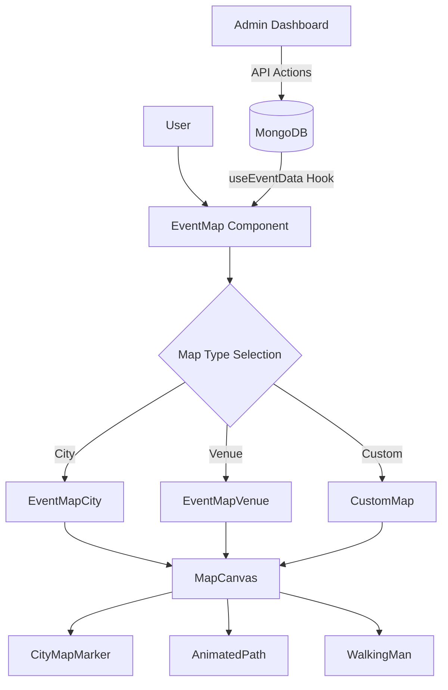

# 🗺️ Jyot Event Map - User Journey

A premium, interactive map platform designed for events, exhibitions, and city-scale journeys. Built with a focus on aesthetics, smooth interactions, and easy administration.


## ✨ Features

- **📍 Dynamic Map Markers**: Hand-crafted SVG structures for different categories (Medical, Cafe, Theater, etc.) with a subtle "breathe" animation on active points.
- **🎨 Multiple Map Styles**:
  - **City Map**: Isometric-style grid with parks and water features.
  - **Venue Map**: Detailed floor plans for indoor events.
  - **Custom SVG**: Full flexibility to use any SVG as a map background.
- **🚶 Interactive Navigation**: "Walking Man" avatar that follows the user's journey between event points.
- **🛠️ Admin Dashboard**:
  - Drag-and-drop marker positioning.
  - Direct event and route management.
  - Real-time map configuration (colors, sizes, styles).
- **📱 Responsive & Performant**: Highly optimized for mobile and desktop using Framer Motion for smooth transitions.
- **🗃️ Data-Driven Architecture**: Powered by MongoDB with a flexible schema for maps, events, and routes.

## 🚀 Tech Stack

- **Framework**: [Next.js 14+](https://nextjs.org/) (App Router)
- **Styling**: Vanilla CSS & Tailwind CSS for layout
- **Animations**: [Framer Motion](https://www.framer.com/motion/)
- **Icons**: [Lucide React](https://lucide.dev/)
- **Database**: [MongoDB](https://www.mongodb.com/) via [Mongoose](https://mongoosejs.com/)
- **State Management**: React Context & Custom Hooks

## 🏁 Getting Started

### Prerequisites

- Node.js 18+
- MongoDB instance (Local or Atlas)

### Installation

1. Clone the repository:
   ```bash
   git clone <repository-url>
   cd user-journey
   ```

2. Install dependencies:
   ```bash
   npm install
   ```

3. Set up environment variables:
   Create a `.env.local` file in the root directory:
   ```env
   MONGODB_URI=your_mongodb_connection_string
   ```

4. Run the migration script to populate the database:
   ```bash
   node scripts/migrate.mjs
   ```

5. Start the development server:
   ```bash
   npm run dev
   ```

## 🏗️ Project Architecture



## 📂 Folder Structure

- `app/`: Next.js routes and server actions.
- `components/map/`: All map-related UI modules.
- `data/`: Initial JSON configurations and scripts.
- `hooks/`: Map state and data fetching logic.
- `models/`: Mongoose database schemas.
- `public/`: Static assets and custom SVG maps.

## 📋 Admin Dashboard

Accessed via `/admin`, the dashboard allows organizers to:
1. **Manage Maps**: Select the active map type and edit global settings.
2. **Edit Events**: Create, delete, and modify event details (Title, Category, Icon, etc.).
3. **Layout**: Simply drag markers on the live preview to update their coordinates in real-time.
4. **Define Routes**: Connect event points with animated paths.

---

> [!TIP]
> Use the **Category** field in the event editor to automatically switch the marker's architectural structure. Try "Cafe", "Security", or "Medical" for specialized visuals.

> [!IMPORTANT]
> The admin dashboard default password is `admin123`. You can change this in the `Settings` collection in MongoDB.
